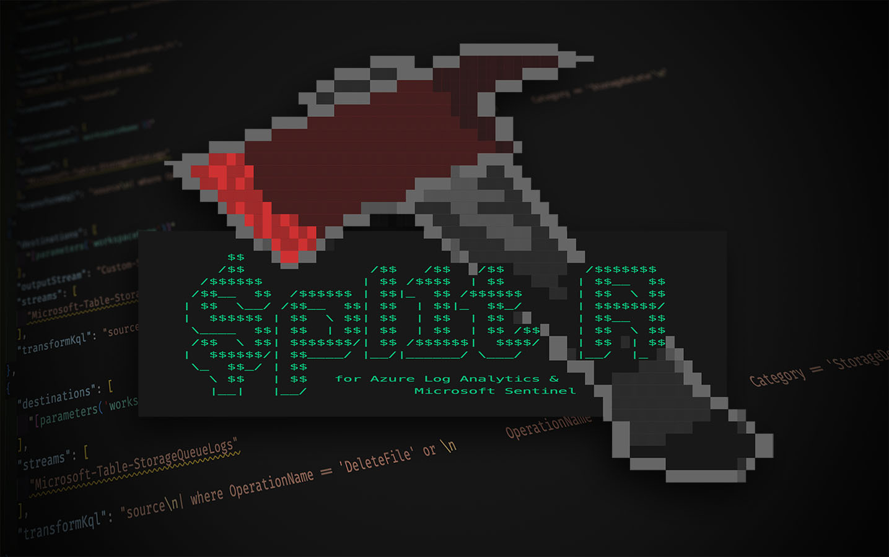

# Split up your logs with $pl1tR
Drop what you don't need and save costs. What's not to like?!



> For more information please read [my article on Medium](https://koosg.medium.com/split-up-your-logs-with-pl1tr-3ab3c76e3125)

## Introduction

This tool will help you generate ARM templates for your workspace-level Data Collection Rules and can deploy them automatically for you.

The table-level transformation queries will be stored in separate YAML files to make them easily accessible and updatable without any knowledge about ARM templates and DCR's in general.

This makes it very easy to integrate this process into your Infrastructure-as-Code pipelines as well!

## File overview

* `log-splitr.ps1` | PowerShell script for automatic workspace DCR creation
* `Workspace-DataCollectionRule-template.json` | Example ARM template generated by `$pl1tR` based on the YAML-files in this repo.

## lot-splitr.ps1

### Prerequisites

Before we can run the script we need to meet a couple of prerequisites:

* The user running `log-splitr.ps1` need to be authenticated to Azure and needs `Contributor` permissions on a Resource Group provided for deployment. If redirecting to additional Basic table is used, the user also needs `Reader` permissions on the workspace to retrieve the schema of an existing table.
* This script needs to be executed in PowerShell 7 and you'll need the `powershell-yaml` PowerShell Module

### Parameters

log-splitr's behavior can be modified with some parameters:

| Parameter | Description |
| --- | --- |
| `SubscriptionId` | The subscription ID of the Azure subscription you want to deploy to and where your workspace resides. |
| `WorkspaceName` | Name of the Log Analytics / Sentinel workspace you want to create the DCR for. |
| `PathToYamlFile` | Location of YAML files with table definitions for this specific workspace. |
| `ResourceGroupName` | Resource group you want to deploy the DCR to. |
| `SaveTemplate` | Add this switch if you want to store the template to file. This helps with debugging but you also might want to use this script one-time only. |

### Examples

```PowerShell
./log-splitr.ps1 `
-WorkspaceName "la-workspace-01" `
-SubscriptionId "<subscriptionid>" `
-PathToYamlFiles  "./transformations/la-logging-01/" `
-ResourceGroupName "rg-logging-01" `
-saveTemplate
```

## You're all set!

If you like this content please follow me on Medium or keep an eye on my Twitter and LinkedIn feeds to get notified once new content is released.

I still wouldn’t call myself an expert on PowerShell. So if you have feedback on any of my approaches above, please let me know! Also never hesitate to fork my repository and submit a pull request. They always make me smile because I learn from them and it will help out others using these tools. 👌🏻

I hope you like this tool and it will make your environment safer as well!

If you have any follow-up questions, please reach out to me!

— Koos
